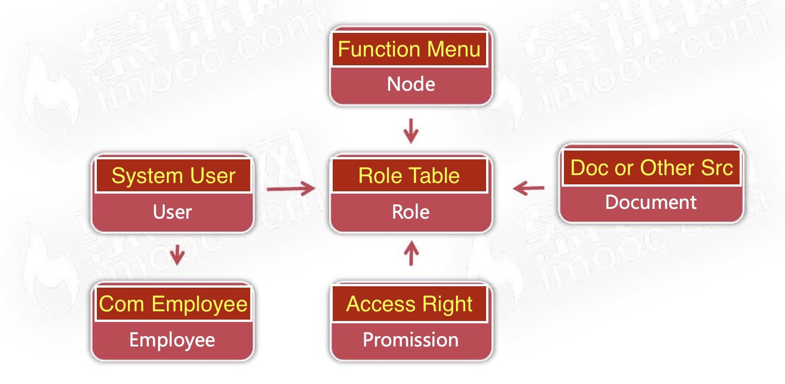
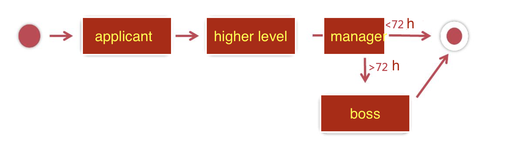

## _Office Automation By Maven Frameworks_

Here, I create one Office Automation online application by Maven, whose target is to know about the process of building one Maven project. This project will express how to use Tomcat, Mybatis and Vue3 to connect MySQL database and show the vue3 based html page through Tomcat server. In this project, I will explain how to use RBAC(Role-Based Access Control) to complete one multi-level vacation approval process.

### Project Frameworks Introduction

1. The project is build on maven, here I use maven 3.8.1 come from '/usr/local/Cellar/maven/3.8.1/libexec', which is only convenient to me;
2. The project use Tomcat 8.5.68, same as Maven edition, I need to record the location in '/Users/rickhuang/Library/apache-tomcat-8.5.68', and Tomcat port set as 8080;
3. As web application, I use servlet 3.1.0 edition, and match with the maven setting;
4. The application on under context of '/rick_oa';
5. This project connect with MySQL that based on the Linux Centos 7, I will set MySQL configuration in 'mybatis-config.xml';
6. The whole project is based on the current known MVC module, which means the following project developing structure:
   ```sh
      HTML(View) - 
      Servlet(Conttroller) -
      Service(Business Layer Model) - 
      Mapper(Data Persistence Layer Model) - 
      MySQL(Database)
7. The main dependencies includes mybatis@3.5.3, mysql-connector-java@8.0.25, junit@4.12, logback-classic@1.2.3 and com.alibaba;
8. In order to make mybatis works, I create the configuration file of 'mybatis-config.xml';
9. Try to test its working by create some test files (maybe delete them lately);
10. Add more configuration on 'mybatis-config.xml' to link the 'DruidDataSourceFactory.java';


### Role Based Access Control in Project

The core of RBAC is to bind the role with the accessed source, and the system User binds with the Role who has the right to access the responsive source, and the basic structure is shown:

Here the promise decides the Role will be which kind of User or can access which Doc or source.

1. I creat some tables under 'rick_oa' database;
2. the 'sys_node' table means the system function definition;
3. the 'sys_role' table means the role definition;
4. the 'sys_user' table means the system users definition, which who can login this table.
5. the 'sys_role_user' and 'sys_role_node' is used to match the role can can be who and can do what;

#### Using Element Plus to create Vue3 based frontEnd

Create directory of "assets" under "webapp" to include the element-plus source code. In this project, I like to import all the predefined min js and css files in html file, click [here](https://element-plus.org/#/en-US) to know about 'Element-Plus' frameworks.

#### Deal with login functions in backend

This project is based on MVC frameworks, where model and view all can be identified by Mybatis frameworks: 
 
1. Here we know that the 'resources/mappers/xxx.xml' use to control the mysql statement, which is same as the real sql statement;
2. The '/entity/xxxClass.java' used to match the responsive MySQL table with column name, 
3. The '/mapper/xxxMapper' will deal with the responsive xxx.xml file and transfer the MySQL statement to entity;
4. All the java business coding put in the 'service/xxxMapper', where we can deal with the provided entity;
5. In order to validate the result, we also can add test files;

After complete the Model coding, I will use Servlet to deal with the Controller part. Based on the diferent interface to produce the different response and use 'Jackson' to get the json string displayed on page.

Here I cannot show the password in plant format, and I need to encrypt the password by 'Apache Commons Codec', which insert it in 'porm.xml'.

#### Deal with RBAC functions in backend

Same as I deal with login functions, I will do: 
1. I create the rbac.xml to execute the sql statement;
2. Create the responsive entity of 'RBAC' and 'Employee' classes;
3. Use business layer of 'RbacMapper' and 'EmployeeMapper' to connect with responsive xxx.xml;
4. Create persistence layer of 'RbacService' and 'EmployeeService' to decouple the java code with database execute;
5. All the service are controlled in 'LoginServlet' and 'UserInfoServlet'.

#### Introduce the vacation process.

After create the employee and responsive forms, mappers and services, I will focus on how to manage the vacation process. This is one main kind of office-automation task. During this process, one employee, as the applicant, will apply the vacation to hir higher level, the manager in his department, where the manager needs to approve and then send it to boss, one last process auditor. If the manager reject the application of vacation, this application process will abort and do not send to boss.


In order to complete the whole process, 


